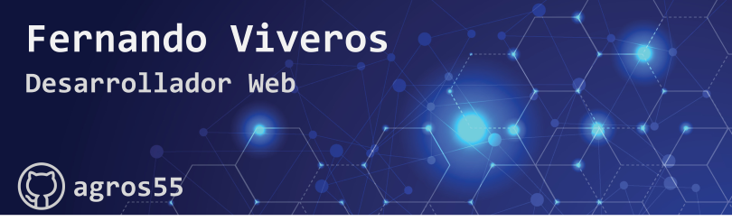

## ¿Quien soy?
Me llamo Fernando Octavio Viveros, tengo 28 años, soy de Argentina.
Soy Analista de Sistemas Informaticos y Desarrollador Web.
Me dedico al FrontEnd con desarrollo puro (HTML, CSS y JavaScript), ademas estoy perfeccionando mis habilidades de desarrollo con React. En el BackEnd utilizo Node.js y Express.js, ademas del manejo de bases de datos MySQL y MongoDB.

## 📈 Mis GitHub Stats

 

## Tecnologias 
### Lenguajes

### Frameworks

### Bases de Datos

### Software

<!--
**agros55/agros55** is a ✨ _special_ ✨ repository because its `README.md` (this file) appears on your GitHub profile.

Here are some ideas to get you started:

- 🔭 I’m currently working on ...
- 🌱 I’m currently learning ...
- 👯 I’m looking to collaborate on ...
- 🤔 I’m looking for help with ...
- 💬 Ask me about ...
- 📫 How to reach me: ...
- 😄 Pronouns: ...
- ⚡ Fun fact: ...
-->
